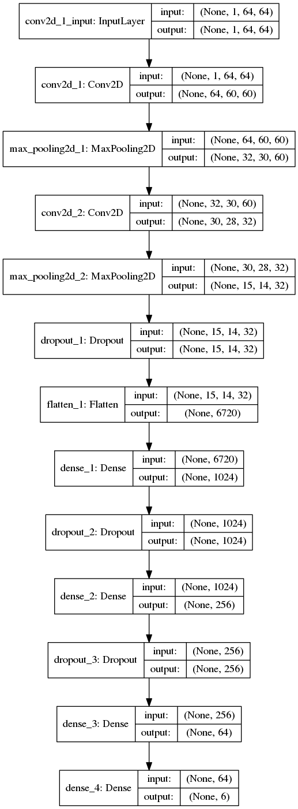

# NNLearning
Learn neural networks using tensorflow, theano and keras

I gather there some materials related with learing about neural networks

## Dice recognitioning:
##### Powered by Keras using Tensorflow backend
Model with Conv2D layers, based on Adam optimizer

#### Model visualization

